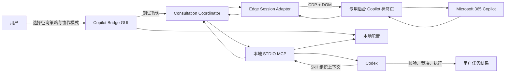
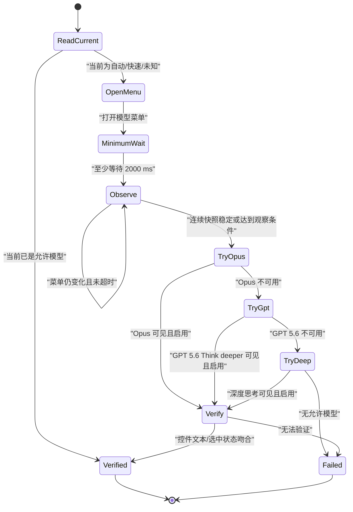

# Microsoft Copilot 项目完整设计

> 设计基线：v1.0
> 日期：2026-07-18（Asia/Shanghai）
> 状态：Phase 0–5 已通过；Phase 6 发布候选版完成，G8 等待第二台团队电脑验证
> 工作名称：Copilot Bridge
> 项目目录：`D:\WorkSpace\Microsoft Copilot`
> 目标模式执行路线图：[EXECUTION-ROADMAP.md](./EXECUTION-ROADMAP.md)

## 1. 项目结论

本项目要做的不是一个通用浏览器自动化平台，也不是另一个多 Agent 框架，而是一个边界明确的 Windows 工具：

> 让 Codex 通过本机已登录的日常 Microsoft Edge，在后台与 Microsoft 365 Copilot 对话，并把回复作为第二模型意见返回给 Codex；Codex始终负责最终判断与实际执行。

最终交付由三部分组成：

1. **Copilot Bridge Windows 应用**：图形化配置、连接诊断、后台网页交互和本地 MCP 服务。
2. **Codex Skill**：规定何时征询、怎样组织上下文、怎样处理 Copilot 回复。
3. **Codex Plugin**：把 Skill 与 MCP 配置打包，供本人和团队成员安装。

核心技术路线固定为：

> `Codex → 本地 STDIO MCP → Copilot Bridge → Edge CDP/DOM → Microsoft 365 Copilot`

日常运行不使用 Computer Use、屏幕识别、Windows UI Automation、物理鼠标键盘模拟或前台窗口切换。

## 2. 已确认的产品决策

| 决策项 | v1 结论 |
|---|---|
| 浏览器 | 团队日常使用的 Microsoft Edge 与现有登录状态 |
| Copilot 地址 | `https://m365.cloud.microsoft/chat/` |
| 自动化方式 | Edge CDP + DOM，只控制一个专用 Copilot 标签页 |
| 前台占用 | 禁止抢占窗口、切换用户当前标签页、移动鼠标或注入物理键盘输入 |
| 协作模式 | Assist、Outsource、Review；由用户在 GUI 中手动选择 |
| 自动路由模式 | v1 不实现；Codex 不得自行切换协作模式 |
| 模型优先级 | Opus → GPT 5.6 Think deeper → 深度思考 |
| 禁用模型 | 自动、快速答复、GPT 5.5 快速响应及其他快速模式 |
| 模型菜单加载 | 打开后至少等待 2 秒，再观察菜单稳定；总等待默认最多 6 秒 |
| 发送确认 | 日常咨询不逐条询问；通过 Codex 的 MCP 单工具审批策略预先授权 |
| 图形界面 | UniFi 的信息架构 + Apple 式克制、留白和细节 |
| 团队复用 | Windows 应用与 Codex Plugin 组合分发 |
| v1 数据形式 | 纯文本/Markdown；不做文件、图片和仓库批量上传 |
| 会话默认 | 一个 Codex 任务对应一个 Copilot 咨询会话；后续追问复用咨询 ID |

最后两项是本设计为未决问题采用的默认假设，未来可以调整，但不影响首个闭环。

## 3. 术语与三个独立控制面

三个控制面必须在代码、GUI 和文档中保持独立。

### 3.1 征询策略：什么时候调用 Copilot

GUI 名称使用“征询策略”，避免与 Copilot 的“自动”模型混淆。

| 策略 | 行为 |
|---|---|
| 关闭 | 拒绝所有咨询调用 |
| 仅手动 | 只有用户明确要求“问 Copilot/Opus”时才允许调用；首次安装默认值 |
| Codex 可自动征询 | 用户明确要求时必定允许；复杂架构、重大方案或明显不确定时，Codex也可以主动调用 |
| 关键设计必须征询 | 对新项目架构、重大重构和高影响决策设置强制核验点；调用失败必须向用户说明，不得静默跳过 |

### 3.2 协作模式：怎样分工

协作模式只能由用户在 GUI 中选择：

- **Assist**：Codex 主导，Copilot 回答一个聚焦问题。
- **Outsource**：Copilot 负责主要的开放式推理或长方案，Codex提供上下文并最终核验。
- **Review**：使用相互隔离的 Copilot 会话执行独立审查，Codex 汇总分歧并裁决。

硬性规则：

- MCP 的 `consult_copilot` 工具不接受 `mode` 参数。
- Codex 不能在工具调用中临时改模式。
- GUI 修改只影响下一次咨询，不改变正在进行的咨询。
- v1 不实现 Assist → Outsource → Review 的自动升级。

### 3.3 模型策略：实际向哪个模型发送

默认优先级队列：

1. Opus
2. GPT 5.6 Think deeper
3. 深度思考

这个队列与征询策略、协作模式无关。即使征询策略为“Codex 可自动征询”，也绝不选择 Copilot 页面中的“自动”模型。

## 4. 目标、非目标与成功标准

### 4.1 v1 目标

- 在不抢占用户前台操作的情况下，连接日常 Edge 中已登录的 Microsoft 365 Copilot。
- 在后台专用标签页中可靠完成模型选择、消息发送、生成等待与 Markdown 回复提取。
- 支持手动选择的 Assist、Outsource、Review 三种协作模式。
- 支持用户明确调用，以及按 GUI 策略允许 Codex 在复杂任务中主动调用。
- 通过本地 STDIO MCP 暴露最小工具面。
- 提供简洁 GUI，完成配置、状态查看、连接诊断与测试咨询。
- 可以打包给使用 Edge 和 Microsoft 365 企业账号的团队成员。

### 4.2 明确非目标

v1 不做以下内容：

- 通用网页自动化平台或通用 Provider 框架。
- 直接调用未公开或逆向得到的 Microsoft 内部 API。
- 网络抓包、HTTP/WebSocket 劫持、代理中间人或请求重放。
- Computer Use、OCR、截图识别、`SendInput`、UIA 或前台鼠标点击兜底。
- 自研 Worker 协议、命名管道 RPC、本地 HTTP 服务、消息队列或数据库。
- 多机器调度、云服务、集中账号托管或远程控制。
- 自动选择 Assist/Outsource/Review。
- 文件附件、图片、整仓库上传或知识库同步。
- DLP、复杂脱敏引擎或企业审计平台。
- 完整保存 Copilot 对话正文。
- macOS、Linux 或非 Edge 浏览器支持。

### 4.3 产品成功标准

只有同时满足以下条件，项目才算达到 v1：

1. 用户正常使用鼠标、键盘和其他 Edge 标签页时，连续 10 次咨询不发生前台抢占。
2. 10 次咨询没有重复发送；任何发送状态不确定时都不自动重试。
3. 延迟加载的模型菜单能够按既定优先级选择并验证实际模型。
4. Edge 未启动、远程调试未启用、登录失效和模型不可用时均返回可理解的错误。
5. Codex 可以通过 MCP 发起咨询、读取结构化结果并继续完成原任务。
6. 第二台团队 Windows 电脑能够按文档完成安装和首次连接。

## 5. 总体架构



### 5.1 进程模型

只发布一个生产可执行文件：`CopilotBridge.exe`。

- 正常启动：打开 WPF GUI。
- `CopilotBridge.exe --mcp`：作为无窗口 STDIO MCP server 运行。
- `CopilotBridge.exe --probe`：开发阶段执行连接与 DOM 探测；稳定后可以保留为诊断命令，但不增加第二个程序。

GUI 不必常驻，Codex 启动的 MCP 进程可以独立工作。两者共享配置文件；命名互斥锁只用于阻止两个进程同时向 Copilot 写入，不承担任务队列职责。

### 5.2 技术栈

| 层 | 选择 | 原因 |
|---|---|---|
| 运行时 | C# / .NET 10，`net10.0-windows` | 当前机器已具备 SDK；适合单文件 Windows 应用和企业部署 |
| GUI | WPF | 成熟、轻量、无需引入 WinUI 打包复杂度，足以实现 UniFi/Apple 风格 |
| 浏览器 | Microsoft.Playwright for .NET，通过 `ConnectOverCDPAsync` 连接 Edge | 使用现有浏览器状态并执行 DOM 级操作 |
| MCP | 官方 C# MCP SDK，STDIO transport | 与 Codex 本地客户端直接集成，无需端口和后台服务 |
| 配置 | `System.Text.Json` | 无数据库，配置可读、可迁移、易诊断 |
| 测试 | xUnit + 静态 DOM fixtures | 覆盖状态机与延迟加载，不依赖每次真实发送 |
| 日志 | `Microsoft.Extensions.Logging` 的简单文件/控制台输出 | 只保留必要诊断，不建事件平台 |

实现时锁定当时的稳定包版本；不在设计阶段预先固定可能已变化的 NuGet 补丁版本。

### 5.3 内部组件

生产代码只设五个主要职责，不为每个类创建一层抽象：

1. **Settings Store**：读写 GUI 配置，原子替换 JSON。
2. **Edge Session Adapter**：连接 Edge、发现并绑定专用 Copilot 标签页。
3. **Copilot Page Driver**：模型选择、编辑器写入、发送、回复提取。
4. **Consultation Coordinator**：执行三种协作模式、会话复用和错误边界。
5. **MCP Host / GUI Shell**：两个入口共用上述业务代码。

只在真正的外部边界使用接口，例如浏览器驱动和时钟；不建立通用 Provider、Transport、Worker、Job、Artifact 等抽象体系。

## 6. 浏览器与后台标签页设计

### 6.1 连接方式

应用连接正在运行的日常 Edge 实例：

1. 用户在 Edge 中为当前实例启用远程调试。
2. 应用从日常 Edge user-data 目录的 `DevToolsActivePort` 获取本机端点。
3. Playwright 使用 CDP 连接现有实例，且不创建新的浏览器配置档。
4. 只枚举识别 Copilot 目标所必需的页面元数据。
5. 远程调试端点只允许本机访问。

v1 不自动启动 Edge，也不在 Edge 关闭后尝试带参数重新启动日常配置档，避免弹出窗口或选择错误的浏览器配置档。

### 6.2 一次性绑定

首次设置流程：

1. 用户在希望使用的 Edge 配置档中打开 Microsoft 365 Copilot 并完成登录/MFA。
2. GUI 显示当前发现的合法 Copilot 标签页。
3. 用户选择一个标签页并点击“绑定”。
4. 应用在该页设置本地标记，并在本次 Edge 生命周期内记录 CDP target 与 browser context。
5. 此后所有操作只在该标签页中完成。

如果标签页在 **同一次 Edge 生命周期** 中被关闭，应用可以在已绑定的 browser context 内调用 CDP `Target.createTarget`，使用 `background=true` 新建后台标签页；创建后仍须验证用户当前窗口和标签页未变化。当前 CDP 文档明确提供后台 target 参数，而 Edge 的 DevTools Protocol 与 Chrome DevTools Protocol 对齐。

如果 Edge 已重启，原 browser context ID 不再可信，应用返回“需要重新绑定”，不猜测另一个配置档。若实机验证发现后台 target 仍会抢占前台，则禁用自动重建并要求重新绑定，不能改用前台点击兜底。

### 6.3 标签页边界

每次准备修改页面前必须同时验证：

- scheme 为 HTTPS；
- host 精确等于 `m365.cloud.microsoft`；
- path 为 `/chat/` 或 `/chat/conversation/{id}`；
- 页面仍带有 Bridge 标记；
- 页面中存在唯一且可编辑的消息输入框。

任一条件不满足就停止，不点击其他页面，也不搜索其他网站。

### 6.4 无前台抢占的硬规则

生产代码禁止调用：

- Playwright `BringToFrontAsync`；
- Win32 `SetForegroundWindow`、`SendInput`；
- Windows UI Automation；
- Computer Use、截图识别或 OCR；
- 操作系统级鼠标、键盘事件；
- 为恢复失败而切换用户当前 Edge 标签页。

DOM 中的 `click`、`fill` 和 `press` 只作用于后台页面内部，不模拟物理设备。若 CDP/DOM 无法完成操作，结果必须失败，不能退化为前台自动化。

## 7. 模型选择状态机

### 7.1 选择算法



默认参数：

- 菜单最短等待：2000 ms；
- 观察轮询间隔：250 ms；
- 稳定条件：连续两个标准化菜单快照相同；
- 菜单最长等待：6000 ms；
- 模型选择后验证超时：3000 ms。

“达到稳定”不允许突破 2 秒最短等待，因为 Opus 与 GPT 详细菜单可能在 1–3 秒后才水合出来。

### 7.2 精确匹配规则

允许中英文别名，但最终匹配必须是标准化后的完整标签，不使用模糊的 `Contains("GPT")`：

- `Opus` / `Claude Opus`；
- `GPT 5.6 Think deeper` / 对应中文标签；
- `深度思考` / `Deep thinking`。

以下标签永不进入候选集：

- 自动 / Auto；
- 快速答复、快速回答、Quick response、Instant；
- GPT 5.5 快速响应；
- 其他名称含“快速/Quick/Instant”的模型。

GPT 5.6 位于 GPT 子菜单时，必须先确认父项为 GPT，再等待子菜单稳定并选择完整的 `GPT 5.6 Think deeper`。绝不能因为只看到 GPT 父项就默认选择其第一个子项。

### 7.3 发送前不变量

只有全部满足时才允许发送：

- 当前模型已读回并属于允许列表；
- 消息输入框唯一且可编辑；
- 页面不处于上一条回复生成中；
- 输入框内容与待发送 Markdown 完全一致；
- 当前用户消息数量和最后一条消息指纹已记录；
- 已取得单写入互斥锁。

无法验证时发送零条消息，并返回 `not_submitted`。

## 8. 一次性发送与回复提取

### 8.1 发送语义

发送动作采用明确的前后边界：

1. **点击发送前**：允许重新解析 DOM、重新连接一次或安全重试读取。
2. **点击发送后**：永不自动再次点击、按 Enter 或重新提交。
3. 如果点击后的页面状态无法判断，返回 `submission_unknown`，由 Codex 告知用户检查原会话。

不得通过在 prompt 中插入内部幂等 ID 来污染对话。幂等性依靠页面回读、消息计数和“发送后不重试”保证。

### 8.2 回复完成判定

发送后记录原有 assistant turn 数量，然后等待新 turn：

- 出现新的 assistant turn；
- 该 turn 不再包含生成中指示器；
- 回复动作控件（例如复制）出现，或正文达到稳定条件；
- 正文间隔 750 ms 的两次读取相同；
- 未出现页面错误、登录页或会话不可用提示。

默认回复超时 300 秒，可在高级设置中调整到 60–900 秒。超时返回已有会话 URL 和 `reply_timeout`，但不再次发送。

### 8.3 Markdown 提取

只从当前新增 assistant turn 的渲染 DOM 提取：

- 标题、段落、列表、引用；
- 行内代码和代码块；
- 链接文本与 URL；
- 简单表格。

不读取整个页面文本，不把侧栏、推荐问题、按钮标签混入回复。Frozen 项目中的渲染 Markdown 提取思路可以重新实现并用 fixtures 验证，但不引用旧项目程序集。

## 9. 三种协作模式

### 9.1 Assist

用途：快速第二意见、局部风险检查、替代解释。

- Codex 仍是主执行者。
- 初始请求只包含一个明确问题。
- 默认最多 2 个 Copilot turn（初答 + 1 次聚焦追问）。
- 回复返回后，Codex必须说明采纳、部分采纳或拒绝了什么。

典型问题：

- “这段路由器配置有没有遗漏的回滚风险？”
- “这个模块边界是否出现了不必要的抽象？”
- “请指出这个诊断结论最可能错在哪里。”

### 9.2 Outsource

用途：开放式架构探索、长方案、复杂问题模拟。

- Skill 先把任务、现状、约束、非目标和期待输出组织成一个 Markdown 包。
- Copilot承担主要推理，但不能直接执行本机操作。
- 默认最多 6 个 Copilot turn；第 3 个 turn 后 Codex先检查是否仍有实质进展。
- Codex必须使用本地代码、日志或官方资料验证关键事实，再形成最终方案。

### 9.3 Review

用途：重大架构、发布前审查、需要独立意见的设计。

- 默认创建 2 个相互隔离的 Copilot 对话，串行执行，不并发操作网页。
- Reviewer A 角色：方案复杂度、边界和替代设计审查。
- Reviewer B 角色：故障模式、证据与可验证性审查。
- 两位 reviewer 均使用同一允许模型优先级；v1 不刻意为多样性选择较低优先级模型。
- Codex按证据裁决，不按多数票决定。
- 只有存在具体矛盾时，允许再向其中一个会话进行 1 次定向追问。

Review 的会话隔离通过新建 Copilot conversation 实现，可以在同一个专用后台标签页中串行导航，不创建多个自动化标签页。

## 10. Codex Skill 设计

Skill 负责工作流，不负责浏览器技术细节。建议名称：`copilot-consult`。

### 10.1 Skill 的触发规则

显式触发：

- 用户说“问一下 Copilot/Opus”；
- 用户要求第二意见、独立审查或多模型讨论。

允许自动触发的条件（还必须满足 GUI 征询策略）：

- 新项目或重大重构的宏观架构刚形成；
- 方案包含多个不可逆或高影响操作；
- Codex发现关键假设无法用本地证据直接验证；
- 方案明显可能出现过度工程化、过度防御性代码或范围膨胀。

不自动触发：

- 简单命令、版本查询和局部文本修改；
- 已有明确测试结果的常规 bug 修复；
- 只是为了“多一个观点”而没有具体问题；
- 同一决策点已经咨询过且没有新证据。

### 10.2 上下文包格式

Skill 将上下文整理为：

```markdown
# 任务

# 已知事实与证据

# 当前方案或争议点

# 约束与明确非目标

# 希望你回答的问题

# 期望输出格式
```

默认只发送与问题有关的摘要和必要代码片段，不上传整个仓库。应用层不会自行扩写、删改或总结该 Markdown。

### 10.3 Codex 的后处理责任

拿到回复后，Codex必须：

1. 区分 Copilot 提供的事实、推断和建议。
2. 用本地状态、测试或官方文档核验可验证事实。
3. 明确列出采纳与不采纳的部分。
4. 自己完成代码、命令、配置和最终答复。

Copilot 回复不是执行授权，也不能覆盖用户边界。

## 11. MCP 工具设计

v1 只暴露两个工具。

### 11.1 `copilot_bridge_status`

用途：读取当前连接与配置摘要，不触发网页写入。

输入：无。

输出包含：

- 应用版本；
- Edge/CDP 连接状态；
- 专用标签页绑定状态；
- 登录状态；
- 当前征询策略；
- GUI 选择的协作模式；
- 模型优先级；
- 是否有咨询正在执行。

注解：`readOnlyHint=true`、`destructiveHint=false`、`openWorldHint=false`。

### 11.2 `consult_copilot`

输入：

```json
{
  "requestMarkdown": "string",
  "trigger": "user_explicit | codex_auto | required_checkpoint",
  "consultationId": "optional string",
  "newConversation": false
}
```

设计约束：

- 不包含 `mode` 或 `model` 参数；两者由 GUI 配置决定。
- `trigger` 用于执行征询策略；“仅手动”会拒绝 `codex_auto`。
- 未传 `consultationId` 时创建新咨询。
- 传入 ID 时复用对应 Copilot conversation。
- `newConversation=true` 显式结束复用并新建会话。

统一输出：

```json
{
  "status": "completed | not_submitted | submission_unknown | reply_timeout | blocked",
  "errorCode": "optional stable code",
  "consultationId": "string",
  "collaborationMode": "assist | outsource | review",
  "responses": [
    {
      "reviewer": "primary | complexity | evidence",
      "effectiveModel": "opus | gpt_5_6_think_deeper | deep_thinking",
      "conversationUrl": "string",
      "markdown": "string"
    }
  ],
  "canRetrySafely": false
}
```

`canRetrySafely` 只有在明确尚未点击发送时才为 `true`。

注解必须诚实：`readOnlyHint=false`、`destructiveHint=true`、`openWorldHint=true`。消息发送到外部企业服务且无法由本工具撤回，因此不能为了减少审批而错误标记为只读。

### 11.3 MCP server instructions

初始化说明的前 512 字符必须独立表达最关键规则：

- 协作模式只由 GUI 决定；
- 发送状态不确定时禁止重试；
- 追问必须复用返回的 `consultationId`；
- Copilot 只提供意见，Codex负责核验和执行。

## 12. 审批与自动调用

用户要求日常发送前不逐条确认。实现方式不是把写操作伪装成只读，而是对唯一写工具进行明确的单工具预授权：

```toml
[mcp_servers.copilot_bridge]
command = "CopilotBridge.exe"
args = ["--mcp"]
default_tools_approval_mode = "prompt"

[mcp_servers.copilot_bridge.tools.consult_copilot]
approval_mode = "approve"
```

状态查询保持普通只读工具。团队版 Plugin 使用同等的 per-tool policy，但具体配置路径在打包阶段按当时 Plugin 规范生成。

企业管理员策略仍可能强制审批；应用不能也不会绕过组织政策。安装向导应检测实际策略并清楚显示“已预授权”或“受管理员策略限制”。

## 13. GUI 产品设计

### 13.1 设计语言

采用 **UniFi 信息层级 + Apple 克制感**：

- 明亮的灰白画布与白色内容面；
- 窄图标栏和简洁二级导航；
- 蓝色表示选择和主要动作，绿色表示健康；
- 细边框、轻分隔、适量圆角和充足留白；
- 使用 `Segoe UI Variable` 与系统图标；
- 默认无深色技术控制台、无渐变大卡片、无密集仪表盘；
- 动效只用于状态过渡，时长约 120–180 ms；
- 支持键盘导航、清晰焦点和 Windows 缩放。

建议基础 token：

| Token | 值 |
|---|---|
| Canvas | `#F6F7F9` |
| Surface | `#FFFFFF` |
| Primary | `#006FFF` |
| Success | `#28C76F` |
| Warning | `#F5A524` |
| Error | `#E5484D` |
| Text primary | `#1D1D1F` |
| Text secondary | `#6E7480` |
| Divider | `#E5E7EB` |
| Corner radius | 8–12 px |

### 13.2 页面结构

#### 概览

- Edge 连接、专用标签页、登录和 MCP 状态；
- 当前征询策略、协作模式、实际模型；
- 最近一次咨询的结果与耗时；
- 主要动作：“测试咨询”；
- 错误时只给一个明确的恢复动作。

#### 协作

- 征询策略四档选择；
- Assist / Outsource / Review 三段式模式选择；
- 各模式回合预算；
- 提示：模式变更只影响下一次咨询。

#### 浏览器与模型

- Edge 远程调试状态；
- 发现并绑定 Copilot 标签页；
- 当前登录状态与目标 URL；
- 允许模型的拖拽优先级；
- 菜单最短/最长等待和回复超时；
- 高级参数默认折叠。

#### 咨询记录

- 时间、来源、协作模式、实际模型、状态、耗时；
- 打开原 Copilot conversation；
- 不默认保存 prompt 与回复正文。

#### 设置与诊断

- 开机启动暂不提供；
- 日志级别和保留天数；
- 导出脱敏诊断包；
- 版本、Plugin/MCP 状态；
- 重置绑定与恢复默认设置。

### 13.3 GUI 行为边界

- 正常最小化由 Windows 管理，v1 不做系统托盘常驻程序。
- 关闭 GUI 不影响已经由 Codex 启动的 MCP 进程。
- GUI 与 MCP 同时发起咨询时，后发者立即显示“另一项咨询正在进行”，不排队。
- 不向普通用户展示 CSS selector、CDP 端口、内部 target ID 或原始协议消息。

## 14. 配置、状态与日志

### 14.1 本地目录

```text
%LOCALAPPDATA%\CopilotBridge\
  config.json
  state.json
  logs\
```

### 14.2 `config.json`

建议首版结构：

```json
{
  "schemaVersion": 1,
  "invocationPolicy": "manual",
  "collaborationMode": "assist",
  "modelPriority": [
    "opus",
    "gpt_5_6_think_deeper",
    "deep_thinking"
  ],
  "menuMinimumWaitMs": 2000,
  "menuMaximumWaitMs": 6000,
  "menuPollMs": 250,
  "replyTimeoutSeconds": 300,
  "assistMaxTurns": 2,
  "outsourceMaxTurns": 6,
  "reviewerCount": 2,
  "storeConversationContent": false,
  "logLevel": "Information",
  "logRetentionDays": 7
}
```

GUI 只允许在合理范围内修改数值。模型队列只能包含三种允许模型，不能把“自动”或快速模式重新加回去。

### 14.3 `state.json`

只保存最小运行元数据：

- 最近绑定和健康检查时间；
- consultation ID 到 Copilot conversation URL 的映射；
- 当前模式和实际模型；
- 最后结果状态；
- 不保存 cookie、令牌、prompt 或完整回复。

配置和状态通过临时文件 + 原子替换写入。首版只有 `schemaVersion: 1` 和直接读取逻辑，不建立通用迁移框架；真实出现第二版格式时再写一次具体迁移。

### 14.4 日志

默认记录：

- 连接、绑定、模型选择与状态转换；
- 选择器命中类型，不记录完整页面 HTML；
- 发送前/后边界、耗时和错误码；
- prompt/reply 只记录长度和 SHA-256 摘要，不记录正文。

诊断导出可以包含经过裁剪的目标 DOM 结构，但必须由用户在 GUI 中显式触发。

## 15. 错误模型

稳定错误码保持少而明确：

| 错误码 | 是否已发送 | 可否安全重试 | 用户动作 |
|---|---:|---:|---|
| `edge_not_running` | 否 | 是 | 启动 Edge |
| `remote_debugging_disabled` | 否 | 是 | 按向导启用远程调试 |
| `tab_rebind_required` | 否 | 是 | 在 GUI 重新绑定 Copilot 标签页 |
| `authentication_required` | 否 | 是 | 在 Edge 标签页完成登录/MFA |
| `invalid_target_page` | 否 | 是 | 检查目标 URL 后重新绑定 |
| `no_eligible_model` | 否 | 是 | 检查账号模型权限或菜单加载 |
| `composer_not_ready` | 否 | 是 | 刷新或检查页面状态 |
| `blocked_by_policy` | 否 | 否 | 修改 GUI 征询策略或管理员策略 |
| `busy` | 否 | 是 | 等待当前咨询结束 |
| `submission_unknown` | 未知 | 否 | 打开原会话人工确认，禁止自动重发 |
| `reply_timeout` | 是 | 否 | 打开原会话等待或读取结果 |
| `reply_extraction_failed` | 是 | 否 | 打开原会话，导出诊断 |

不实现通用重试中间件。只有明确处于发送前的连接/DOM 读取允许一次针对性恢复。

## 16. 项目结构

```text
Microsoft Copilot\
  CopilotBridge.sln
  PROJECT-DESIGN.md
  README.md                         # 实现开始后增加，只写安装和运行
  src\
    CopilotBridge\
      CopilotBridge.csproj          # 唯一生产项目
      App.xaml
      Program.cs
      UI\
        Views\
        ViewModels\
        Theme\
      Application\
        ConsultationCoordinator.cs
        Models\
      Infrastructure\
        Configuration\
        Edge\
        CopilotWeb\
        Mcp\
      Resources\
        m365-copilot-web.json
  tests\
    CopilotBridge.Tests\
      CopilotBridge.Tests.csproj    # 唯一测试项目
      Fixtures\
  plugin\
    .codex-plugin\
      plugin.json
    .mcp.json
    skills\
      copilot-consult\
        SKILL.md
    assets\
  docs\
    INSTALL.md
    TEAM-ROLLOUT.md
    TROUBLESHOOTING.md
```

不创建 `Core`、`Domain`、`Contracts`、`Adapters`、`WorkerRuntime` 等一组独立项目。命名空间足以表达内部边界。

## 17. Frozen 项目迁移边界

`D:\WorkSpace\ChatGPT` 继续保持冻结，绝不引用其 `.csproj`、DLL 或运行时组件。

只允许重新实现以下经过验证仍有价值的思路：

| 可迁移思路 | 新项目做法 |
|---|---|
| M365 Copilot host/path 与模型别名 | 压缩为一个内嵌的 `m365-copilot-web.json` |
| 渲染 DOM → Markdown | 在单一 Page Driver 中重新实现并用 fixtures 测试 |
| Copilot turn DOM 识别 | 只保留新 user/assistant turn 和生成状态判断 |
| STDIO MCP host | 使用当前官方 C# MCP SDK 重新实现两个工具 |

明确丢弃：

- Control/Capture 多版本协议；
- Worker、CLI、多个可执行文件；
- Admission/inbox/任务认领；
- 网络捕获和一次性 HTTP 转发门；
- 自定义传输记录、证据封存和哈希闭环；
- 多 Provider 和兼容性框架；
- 未被首个真实闭环证明必要的恢复机制。

旧项目只作为经验与反例，不能成为新项目依赖。

## 18. 测试策略

### 18.1 单元测试

- 模型别名标准化和禁用列表；
- Opus → GPT 5.6 → 深度思考优先级；
- 征询策略对 `trigger` 的允许/拒绝；
- 配置范围验证和原子写入；
- 发送前/发送后错误到 `canRetrySafely` 的映射；
- consultation ID 复用规则。

### 18.2 DOM fixture 测试

至少覆盖：

1. 初始只有自动、快速答复、深度思考，2.5 秒后出现 Opus/GPT。
2. Opus 可见但禁用，回退 GPT 5.6。
3. GPT 子菜单同时出现 5.6 与 5.5，必须选择 5.6。
4. 前两者不可用，选择深度思考。
5. 只有禁用模型，发送零次。
6. assistant reply 生成中、完成、超时和错误。
7. Markdown 中的代码块、列表、表格与链接。

### 18.3 实页验收

实页测试逐级进行，不以大量离线测试替代真实闭环：

| Gate | 操作 | 通过条件 |
|---|---|---|
| G1 | 连接日常 Edge、读取目标页状态 | 不切前台、不访问其他标签页内容 |
| G2 | 后台打开模型菜单并选择 Opus | 等待水合后准确选择并读回 |
| G3 | 用户点击 GUI“测试咨询”发送一条无害消息 | 只发送一次并读取完整回复 |
| G4 | Codex 通过 MCP 执行 Assist | 返回结构化结果并继续原任务 |
| G5 | 连续执行 10 次咨询 | 零重复发送、零前台抢占 |
| G6 | 用户同时操作鼠标、键盘和其他 Edge 标签页 | 当前窗口、当前标签和光标均不被改变 |
| G7 | 测试 Edge 重启、登录失效、模型回退 | 返回预期错误或回退结果 |
| G8 | 第二台团队电脑安装 | 独立完成首次绑定和 MCP 调用 |

在用户没有明确触发测试咨询前，开发过程不应自行向真实 Copilot 发送消息。

## 19. 开发里程碑与硬门槛

各阶段的 Goal 文本、自动执行授权、时间预算、状态记录和停止条件见 [EXECUTION-ROADMAP.md](./EXECUTION-ROADMAP.md)。本节保留总体里程碑定义。

### Phase 0：设计与仓库基线

交付：

- 本设计文档；
- 初始化 Git；
- 创建一个生产项目和一个测试项目；
- 写入最小 `.gitignore`。

通过条件：目录结构与复杂度预算一致。不得提前生成 GUI 页面、MCP 工具和抽象框架。

### Phase 1：Edge/CDP 功能探针

在同一个生产项目中实现 `--probe`：

- 连接日常 Edge；
- 绑定已打开的 Copilot 标签页；
- 在同一 browser context 中后台重建一次测试标签页，并确认未切换前台；
- 读取当前模型；
- 后台打开菜单并执行模型优先级；
- 在用户点击确认的探针命令中发送一条测试消息并读取回复。

通过条件：G1–G3 全部通过。若无法做到无前台抢占，暂停项目并重新评估技术路线，不开始 GUI。

### Phase 2：最小业务核心

交付：

- Settings Store；
- Edge Session Adapter；
- Copilot Page Driver；
- Consultation Coordinator 的 Assist；
- 单元与 DOM fixture 测试。

通过条件：发送前/后边界和所有模型回退 fixtures 通过；生产代码累计不超过约 2500 行。

### Phase 3：薄 GUI 纵切

交付：

- 概览；
- 协作模式/征询策略设置；
- 浏览器绑定与模型设置；
- 测试咨询；
- 基础 UniFi/Apple 主题。

通过条件：非开发人员可以不看日志完成首次绑定和一次测试咨询。此阶段不做动效精修、托盘或安装器。

### Phase 4：Codex MCP + Skill

交付：

- `--mcp` STDIO 模式；
- 两个 MCP 工具；
- `copilot-consult` Skill；
- 项目级本地 MCP 配置。

通过条件：G4–G6 通过；逐工具预授权实际生效；任何不确定发送都不重试。

### Phase 5：完整三模式

依次加入：

1. Outsource 多轮复用；
2. Review 的两个隔离会话；
3. 最小咨询记录。

通过条件：三种模式均由 GUI 手动选择，MCP schema 中仍不存在 `mode`，Codex 能正确裁决 Review 分歧。

### Phase 6：团队分发

交付：

- 稳定路径的 Windows 安装包；
- `.codex-plugin/plugin.json`、`.mcp.json` 与 Skill；
- 安装、团队部署和故障排查文档；
- 第二台电脑试点。

通过条件：G7–G8 通过。先完成团队内部安装，不提前建设公共市场、自动更新服务或遥测后台。

## 20. 反过度工程化预算

以下不是建议，而是 v1 的硬限制：

- 生产项目最多 1 个，测试项目最多 1 个。
- 生产可执行文件只有 `CopilotBridge.exe`。
- 首个真实闭环前生产代码目标不超过 2500 行；完整 v1 目标不超过 7000 行，生成代码与测试除外。
- 直接生产 NuGet 依赖原则上不超过 5 个。
- 不创建数据库、本地 Web server、后台 daemon、消息队列或自定义 RPC。
- 不为尚未存在的第二个 Provider 建抽象。
- 不为尚未出现的配置版本建迁移框架。
- 不为理论上的浏览器故障叠加第二套自动化技术。
- 不用测试数量代替真实网页闭环。
- 新功能只有在出现真实用户案例、可复现故障或明确团队需求后才进入设计。

每个里程碑结束时删除未使用的抽象和代码；“未来可能有用”不是保留理由。

## 21. 主要风险与应对

| 风险 | 应对 |
|---|---|
| Microsoft 365 Copilot DOM 变化 | 小型 provider 资源 + 精确可访问性定位 + fixture + 清晰错误，不增加 OCR 兜底 |
| Edge CDP 对日常配置档兼容性不足 | Phase 1 先做真实探针；失败就停止，而不是并行维护两套实现 |
| 后台新建标签页仍抢前台 | 只用 `Target.createTarget(background=true)` 且经过实机门禁；失败则禁用自动重建 |
| 模型菜单延迟水合 | 2 秒最短等待、稳定快照和 6 秒总窗口 |
| 点击发送后网络状态不明 | `submission_unknown`，禁止重发，返回原会话 URL |
| 企业策略强制 MCP 审批 | 检测并显示，不能绕过；由管理员调整策略 |
| 多个 Codex 任务同时调用 | 单写入互斥锁，后发立即 `busy`，不实现队列 |
| Review 变慢或消耗过多额度 | 默认两个 reviewer 串行、有限回合，GUI 可切回 Assist |
| 团队 Edge 配置档不同 | 一次性显式绑定，不猜测账号或 Profile |

## 22. 发布定义

### 首个可用版本（0.1）

仅包含：日常 Edge 绑定、后台模型选择、一次 Assist 发送/读取和基础 GUI。它用于证明技术路线，不对外分发。

### 团队 v1

包含：

- 三种手动协作模式；
- 四档征询策略；
- 模型优先级与延迟水合；
- 两个 MCP 工具与 Skill；
- GUI 设置、诊断和最小历史；
- Windows 安装与 Codex Plugin；
- G1–G8 全部通过。

### v1 之后才评估

- 自动选择或升级协作模式；
- 文件和图片附件；
- 系统托盘与开机启动；
- Edge 重启后的自动跨 Profile 恢复；
- Review 的指定模型矩阵；
- 集中团队配置与自动更新；
- 其他 Copilot 页面或其他模型服务。

这些项目不进入当前代码，只有在真实使用证明必要后另立设计。

## 23. 设计依据

- OpenAI：MCP 连接外部系统，Skill 定义可复用工作流，Plugin 负责团队分发。
- OpenAI：Codex 桌面、CLI 和 IDE 扩展共享本地 MCP 配置；本项目使用 STDIO server。
- OpenAI：写工具必须使用准确的安全注解，逐工具审批可以单独配置。
- Microsoft Edge：通过 DevTools Protocol 连接正在运行的 Edge，并可使用日常 user-data 目录。
- Playwright .NET：Chromium 可通过 CDP 接入现有浏览器实例。

当前参考：

- https://learn.chatgpt.com/docs/extend/mcp
- https://learn.chatgpt.com/docs/build-plugins
- https://learn.chatgpt.com/docs/agent-approvals-security
- https://learn.microsoft.com/en-us/microsoft-edge/web-platform/devtools-mcp-server
- https://learn.microsoft.com/en-us/microsoft-edge/devtools/protocol/
- https://chromedevtools.github.io/devtools-protocol/tot/Target/#method-createTarget
- https://playwright.dev/dotnet/docs/api/class-browsertype

## 24. 下一步唯一入口

本设计确认后，只执行 **Phase 0 → Phase 1**：初始化最小仓库，并用同一个生产项目完成 Edge/CDP 探针。

在 G1–G3 通过以前，不开始完整 GUI、不创建 Plugin、不实现三种模式，也不从 Frozen 项目复制代码。首个要证明的问题只有一个：

> 能否在用户继续正常使用电脑和 Edge 的同时，后台准确选择 Opus、发送一次消息并读回回复，且完全不抢前台、不重复发送？
